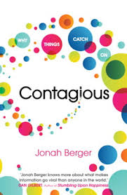

#Contagious: Why things catch on
 
##Jonah Berger

!
 

>You don't have to have millions of dollars to spend on an advertising budget. You just have to get people to talk. The challenge, though, is how to do that

###STEPPS - Six steps

1. **S** 
2. **T**
3. **E**
4. **P**
5. **P**
6. **S**

!

 

1. **S**ocial currency 
2. **T**riggers
3. **E**motion
4. **P**ublic
5. **P**ractical value
6. **S**tories

!

1. **S**ocial currency. Mensen moeten het gevoel krijgen insider te zijn (slim, niet dom etc.). We geven ze info die ze verder willen verspreiden (hoor mij eens!).
2. **T**riggers ; top of mind leads to tip of tongue. het onderwerp/product moet vak getriggered worden door de omgeving. Dan komt het vaker ter sprake.
3. Emotion; Emotional things often get shared. focus op emotions ipv functionaliteit. Negatieve emoties zouden zelfs kunnen.
4. public; money see money do. Make things public, make them observable, so they can be copied.
5. Practical value: we need to make highlight the incredible value of our product.
6. Stories; we need to make the message so integral of the narrative that people can’t tell the story without it.

