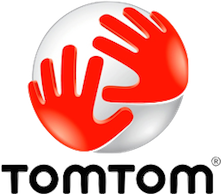
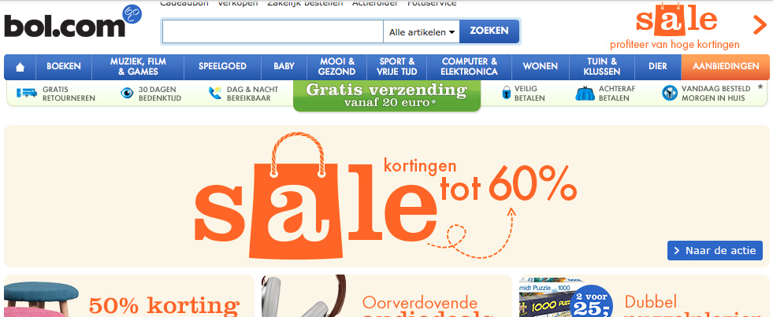
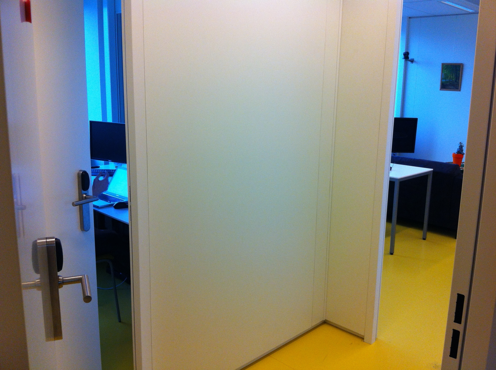
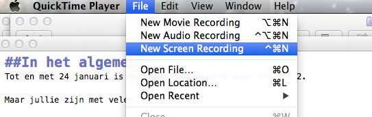

#Project 2   
#Gebruikerstest

!


#Gelukkig nieuwjaar

!
####Michel Alders Mens Machine Interactie / Onderzoek  



!


##HvA
Ruim een jaar  

- Coördinator user lab  


!

##User lab
Het belangrijkste voor vandaag is dat jullie in staat zijn om in het user lab te testen.

  

!
##Nu
Dus ik loop even de **procedures** en **wizards** met jullie door.

Maar het is natuurlijk ook heel belangrijk dat jullie **resultaten** boeken met het doen van onderzoek…


!
#Agenda

1. goed onderzoek doen

2. user lab procedure


!

#De helft van het werk


**Een goede voorbereiding**!

!
##Hoe bereid je je goed voor?

Goed na- en doordenken.  


Wat is het **doel van de test**???

- Wat is het **doel** van het Minimal Viable Product (MVP) dat ik ga testen?  

- Welke **aspecten** zijn belangrijk?  
  
- En **hoe** gaat het MVP dat voor elkaar krijgen?  




!
###Een draaiboek maken en testen...


- Chronologisch overzicht van de test (vooraf, tijdens, achteraf)

- Checklist  

	- Wat zeg je wanneer  

	- Wat doe je wanneer  

Er is een template maar...

!

##Testopzet template download later

!
###Prototype 1.0 

Doel en aard MVP zijn bekend  


Maar... er is altijd ruimte voor verbetering    


!
####De gebruikerstest als ontwerptool  

!
###Schok

Het resultaat is zo goed als altijd **schokkend**  
Het valt altijd tegen wat de gebruiker van het ontwerp begrijpt.

!
	   
 
  

!
###Research fallacy

Vooral bij het testen van eigen werk:  

Testen om zelfvertrouwen te verhogen  

De wil om positieve resultaten te krijgen  



!
###Perfecte wereld?

!
###Perfecte wereld?

Als die bestaat dan bestaat er ook een perfecte test

!
###Altijd opnieuw


Onderzoek bouw je meestal van scratch op.


- Wat is het product

- Wat wil ik weten

- Hoe kom ik daarachter

!


###Where are you now?

Waar jullie nu zitten weet ik niet.  

Maar:    


•	agile   
•	lean  
•	iterative  
•	minimal  


!
###Disclaimer

Wat ik jullie vandaag te bieden heb, zijn louter algemeenheden.  


!

###Interactief
Is het bijvoorbeeld interactief?


!
###Denk hardop?
Vraag je de proefpersoon om hardop na te denken?

!
###Hardopdenken

Verbaliseer je gedachten tijdens het TV kijken.  
  

!
###Live commentaar
Bij film kan ik me voorstellen dat je aangeeft:


**“Voel je vrij om commentaar te geven tijdens de film; we stellen dat zeer op prijs.”**


!

##Kortom
Het is dus zaak om goed na te denken over  
- Het doel van het product  
- Hoe dat bereikt wordt  
- Hoe je dat slim kunt testen  

!
##Slim testen

Slim testen betekent dat je de testpersoon zo natuurlijk mogelijk blootstelt aan cruciale aspecten van je prototype.  


!

###Een sociaal psychologisch experiment

Je vertelt zelden de ware bedoeling van een onderzoek  



- We testen of je snapt dat "Bestel NU" de koopknop is.



!
###Valkuil
Bij een gebruikerstest lok je mensen in de val  

  


!
###Testpersoon

- zo naturel mogelijk in aanraking krijgen met je product  

- **naïef** als een gebruiker thuis achter de computer

!
###Hoe naïef kun je zijn?
  
 

Doelgroep testen is best  

Goede testpersonen worden belangrijker naarmate je product finaler wordt  

!

#0


!
##Ready to test?
Voorbereiding:  


- De juiste introductie  
- De juiste instructies / taken  
- De juiste vragen achteraf  


!
###Vraag en antwoord

- wat wil ik weten? --> **Onderzoeksvragen**  

- hoe kom ik dat slim te weten --> **Taken en gebruikersscenario**  

~Iteratief; 


!
###Opzet test
Hoe voer je de test uit?  
Maak een goed lopend draaiboek  

- Doorloop het mentaal  
- Proefdraaien met een groepsgenoot  

!

####Co-discovery

Als je 2 mensen samen laat kijken naar een film en van commentaar laat voorzien?   

    
Wiens ogen worden getraceerd?

!
 
##Introductie
Persoon in de juiste mindset krijgen.  

Interview  

- eventueel gebruiken voor een scenario on the fly...


!
##De test

**Onderzoeksvraag**: begrijpt de doelgroep de boodschap van mijn video

**Taak**: bekijk de film  

!

**Scenario** (wat je de testpersoon vertelt):  
Je hebt een vakantie gepland met vrienden. Lekker naar Spanje in een goedkoop appartement.
Nu krijg je een email van een vriend met een link en deze tekst:  

"Moet je hier eens naar kijken. Wat denk jij?")

Je hebt alle tijd, dus je besluit de link te openen...


!
###Taak / instructie  


**Niet zo**: Wat vind je hiervan?  

**Maar zo**: Wat is dit volgens jou?

!
###Taak / instructie:  


**Niet zo**:
Kun je me laten zien hoe je "Naar de actie" gaat?

**Maar zo**: Je wilt kijken of er leuke aanbiedingen zijn. Hoe zou je dat doen?  



!
###Taak / instructie:  


**Niet zo**: Kun je laten zien hoe je inlogt?  



**Maar zo**: Kun je laten zien hoe je een plaats reserveert?  



!
###Prompts

Jouw reacties zijn heel bepalend.  

Hier gaat het vaak mis.  

!
####Regel

Zeg liever te weinig dan teveel  





!
####Niet zo
testpersoon: Wat is een UID?  

proefleider: Dat is een Unique Identifier. Een nummer dat op het product staat.  

testpersoon: Wat moet ik dan invullen  

proefleider: doe maar een getal   
 

!
####Maar zo

testpersoon: Wat is een UID?  

proefleider: Wat denk je?  

testpersoon: Geen idee  

proefleider:  

testpersoon: Moet ik zomaar iets invullen?   

Proefleider: Wat zou je doen als ik er niet was?   

!

####Waardevolle informatie verzamelen

Wat testpersoon zegt is waardevol:  

- Ik zou de helpdesk bellen  
- Ik zou de helpdesk mailen  
- Ik zou deze vraag overslaan  
- Ik zou zomaar wat invullen  
- Ik zou iets anders gaan doen  

proefleider: Oke, je antwoord is heel nuttig...   

!

###Prompts

Testpersoon: Wat moet ik doen?  

Proefleider:  
- Wat zou je doen als ik niet naast je zat    
- Wat zou je doen als je thuis was  
- Ik wil graag dat je doet wat je normaal gesproken doet   

- Weet je de taak nog?

!
###Prompts
Onduidelijk gedrag:  

- Wat denk je  
- Waar kijk je naar  
- Wat doe je nu  
- Is dat wat je verwacht had  

LIteratuur: Steve Krug  
*Rocket surgery made easy*   

!
###Helpen?
De testpersoon helpen kan bv:  
- als het om een bug gaat  
- als het te lang duurt  
- als er te ver afgedwaald wordt  

!
##Achteraf / Exit interview:
Wat vraag je als je een film hebt laten zien???

!

#En?  

!
###Of:  

Kun je me vertellen wat je gezien hebt?   

!
###Of:  

Kun je vertellen waar de film over gaat

!
###Of
Wanneer  
Wat  
Wie  
Waarom  
Welke  
Hoe vaak  
etc.  

!

###En/Of
De film nog eens afspelen en er over discusseren  

!
##Analyse

Tijden de test ** NOTITIES** MAKEN  
- Observeer gedrag   
- Luister  
- Noteer!!!  

**Bewijslast**:  
ONS onderzoek heeft uitgewezen  

!
###3 dingen
Als de testpersoon weg is...  

- iedereen noemt zijn/haar drie meest belangrijke issues  

!

###Trello  
Maak gelijk een to do lijst  
- issues (slim geordend - effect / effort)
- oplossingen  
- wie doet wat   

!
##De cijfers!
Resultaten zijn vooral **observaties**, maar cijfers zijn ook handig  

- rapportcijfers bijvoorbeeld

!
###NPS
- Net promoter scale (variant)  

Hoe waarschijnlijk is het dat je dit filmpje aanbeveelt aan een vriend of collega?   

0 	=  helemaal niet waarschijnlijk  
10 	=  extreem waarschijnlijk  

  

!
###SUS
System Usability Scale (10 vragen op  een 5 puntsschaal)

  

I think that I would like to use this system frequently.  
I found the system unnecessarily complex.  
I thought the system was easy to use.  
I think that I would need the support of a technical person to be able to use this system.  
I found the various functions in this system were well integrated.  
I thought there was too much inconsistency in this system.  
I would imagine that most people would learn to use this system very quickly.  
I found the system very cumbersome to use.  
I felt very confident using the system.  
I needed to learn a lot of things before I could get going with this system.  
 
[I have a Dutch translation...]
  
!
#User lab
 

!

#Nu 
###Filmpje user lab  
###testen in het user lab  
Of niet in het user lab testen  

!
#Intermezzo?
de INHOUD

!

##Jonah Berger
##Contagious: Why things catch on

!

>You don't have to have millions of dollars to spend on an advertising budget.  
You just have to get people to talk.

**STEPPS - Six steps**

1. **S** 
2. **T**
3. **E**
4. **P**
5. **P**
6. **S**

!

**Zo laat je mensen praten:**

1. **S**ocial currency 
2. **T**riggers
3. **E**motion
4. **P**ublic
5. **P**ractical value
6. **S**tories

!

-1- **S**ocial currency  
Mensen moeten het gevoel krijgen insider te zijn (slim, niet dom etc.).  
Geef mensen info die ze verder willen verspreiden  

**hoor/zie mij eens!**
	
!

-2- **T**riggers  
Top of mind leads to tip of tongue.  
Iets komt vaker ter sprake als het vaker getriggered wordt door de omgeving / context.  

**I've got it**

!

-3- **E**motion  
Iets dat mensen raakt/emotioneert, wordt vaker gedeeld.  
Focus op emoties ipv op functionaliteit.  
Ook negatieve emoties kunnen gebruikt worden.  

**I am flabbergasted**

!

-4- **P**ublic  
Money see money do.  
Maak zaken publiek.  
Maak ze observeerbaar zodat ze gekopieerd kunnen worden.  

**Everybody can see me now**

!

-5- **P**ractical value  
Benadruk de praktische waarde van het produkt.  

**I am handy**

!

-6- **S**tories  
De boodschap moet een integraal onderdeel van het verhaal zijn.  
Het verhaal zou niet zonder de boodschap verteld moeten kunnen worden.  

**Let me tell you the news**

!
##Goed onderzoek doen

!
##Filmpje user lab

[eyetracking video](http://www.youtube.com/watch?v=TXYtbCdLpBo&feature=youtu.be)  

  

!

##In het algemeen:
Tot en met 24 januari is het lab gereserveerd voor Project 2.   

Maar jullie zijn met velen.

!

##Testen


1. buiten het lab

2. in het lab

!
###Buiten het lab testen

**QuickTime Player** Standaard  

  

!

  

!
###Buiten het lab testen

http://silverbackapp.com/  

http://magitest.com  

http://www.uxrecorder.com  

http://www.techsmith.com/morae.html  

!
####mobiel testen

[NYT - Opnames maken van de smart phone blijkt een sticky problem](http://pogue.blogs.nytimes.com/2013/03/28/an-easy-way-to-capture-live-video-of-your-iphones-screen/?nl=technology&emc=edit_ct_20130328) 
 
 
[Oplossing is ms streamen naar laptop en het daar opnemen:](https://www.reflectorapp.com)    

 
!
####Mobiel testen
Te leen (bij Michel Alders):  

  

!
#Downloads
!

#

!
#In het lab testen
Lees de instructies voor het naar het lab gaan!  

!
#
!

#

!
###Tobii
Kies voor:  
- web (link naar een specifieke website)  
- movie (browse naar je film die op de PC staat)  
- screenrecording ()

!

###Inschrijven
#[Link naar GDrive](https://docs.google.com/spreadsheet/ccc?key=0An2fuYSJ-9EsdFNPTjhDbkpCNnJjVmdEMnNraUN5OUE&usp=sharing)  

!

###4 aanknoppen  
- scherm huiskamer  
- pc huiskamer  
- pc observatieruimte  
- TV observatieruimte  

!
###Lab
  

!

###TV

  
!

##Toegangspas
In de propadeusekamer!  

1. Ophalen   
2. Groepsgenoten binnenlaten  
3. Pas gelijk terugbrengen  
4. Deur dicht doen als je weggaat (gaat automatisch op slot)  

!

#Thank you
!
